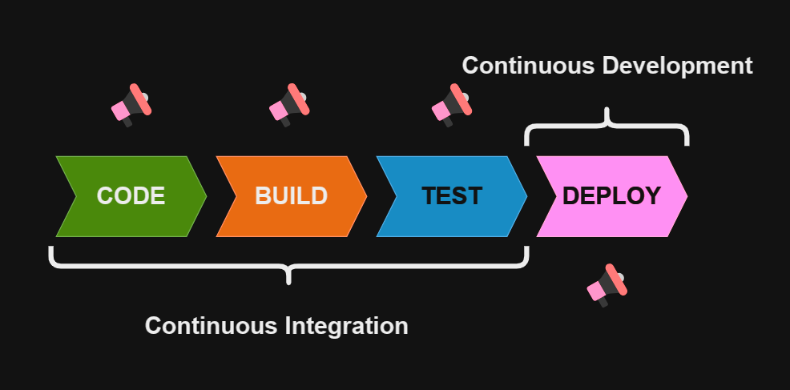

# Continuous Integration

**Links úteis**:

- <https://docs.flutter.dev/deployment/cd#cicd-options>;
- <https://www.alura.com.br/artigos/flutter-ci-cd>
- <https://pedrohjmartins.medium.com/smoke-testing-dfcd62903648>;

Consiste no conjunto de estratégias para facilitar e dar segurança aos merges (integração). Um fluxo robusto de CI possibilita a realização mais frequente de merges no código, com mais segurança e mais tranquilidade.

Além disso, um CI requer frequência na realização de *feedbacks* entre os desenvolvedores, seja para comunicar a realização de alguma das etapas, seja para reportar erros.

Cada merge de uma nova alteração desencadeia uma série de atividades que serão responsáveis por verificar o impacto daquela alteração.

## Etapas do CI

1. **Code**:
    - É a etapa dedicada à produção das alterações no código;
    - Nela o dev irá realizar a implementação das task;
2. **Build**:
    - É a etapa de compilação de um artefato que possa ser executado em um ambiente voltado para os testes;
    - Nessa etapa é importante se assegurar que variáveis de ambiente, secrets, conexões e demais aspectos estejam configurados corretamente;
3. **Test**:
    - É a etapa responsável por assegurar a qualidade e segurança do teste

- Todo o nosso fluxo atual é feito manualmente;
- A essência do CI é a automação. No futuro nós poderemos utilizar programas específicos, como o Jenkins;
- É recomendável que se produza sempre alguma análise (bloco de notas, OneNote, Notion, Word), por menor que seja, de cada etapa;

## Testes

**1. Smoke Test:**

- É um tipo de teste geralmente realizado por QA's;
- Também pode estar inserido em um fluxo automatizado;
- Visa detectar se as funcionalidades mais essenciais e críticas estão feitas;
- É como se fosse um pré-teste;

**2. Unit Test:**

- Os testes unitários são responsáveis por garantir a validade de cada método criado/alterado, evitando que retornos inesperados sejam dados;

**3. Integration Test:**

- Tratam da aplicação de uma foram mais holística;
- Verificam a integração das funções;
- É por meio dele que se pode ter a certeza que um fluxo está operacional;
- Ele garante que o transporte de dados esteja acontecendo funcionalmenteç

**4. Testes de admissibilidade**:

- São testes responsáveis pela admissão da alteração;
- Podem incluir aspectos de UI, UX, logs, performance e demais aspectos;
- Podem variar conforme cada feature;