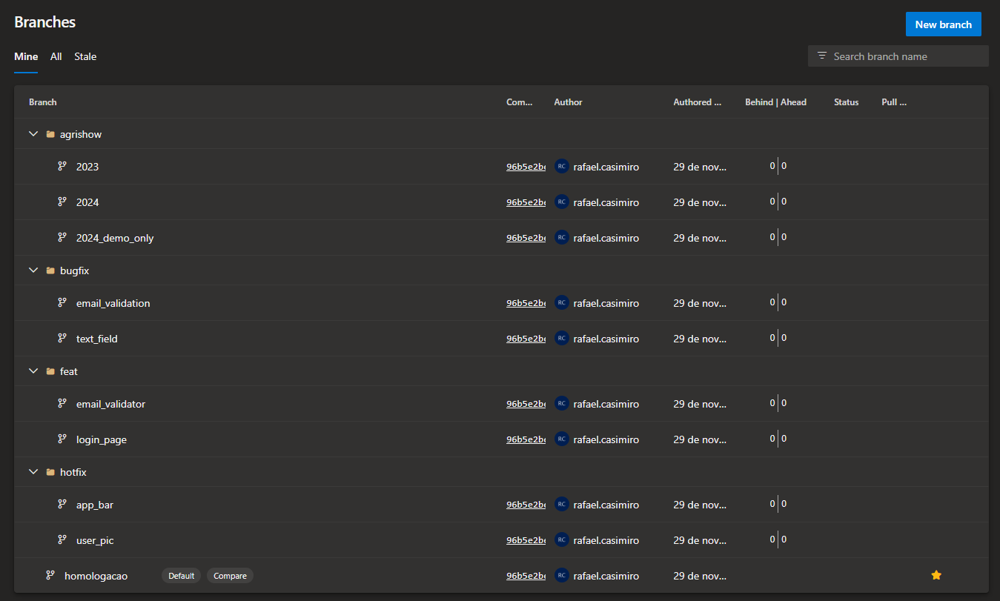
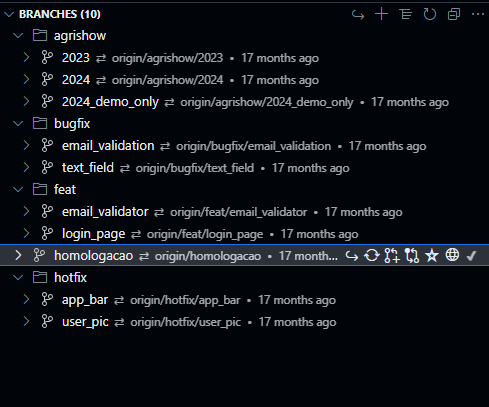

# GitFlow

## Branch

### Long-Running Branches

São as branchs que possuem tempo de vida permanente no código. São branchs caracterizadas por sua perenidade.

Elas irão indicar os ambientes de desenvolvimento do código, podendo ser classificadas em estáveis e não estáveis.

A principal é a `main/master`, da qual se deverivam a `homologation/staging` e a `developer`.

Essas branches também serão caracterizadas por um nível maior de proteção. Em especial, a possibilidade de serem alteradas exclusivamente por meio de `Pull Requests`.

- **Main/Master**:
  - Será uma branch com uma versão estável do código;
  - Frequentemente estará atrás da branch `staging`;
  - Ela terá um código pronto para uso;
  - É a versão que estará em produção;
- **Homologation**:
  - Será uma branch com uma versão estável do código;
  - Frequentemente estará a frente da `main/master`;
  - Apenas features aprovadas poderão estar presentes na branch;
  - Ela também será caracterizada por ser um código pronto, porém que ainda não está em produção;
  - Estará no ambiente de produção, porém para testes;
- **Developer**:
  - Será uma branch com uma versão menos estável do código;
  - Será a versão mais atualizada do código;
  - Será responsável por conter uma ou mais features em estado de teste;
  - O ambiente de testes será simulado;

### Short-Lived Branches

São branchs com um tempo de vida definido. Seu ciclo de vida é não perene, devendo sempre ser excluídas após atingido seus respectivos objetivos.

Em sua essência, não são responsáveis por representar nenhum ambiente.

Diferentemente das branches `long-running`, elas serão atualizadas via *commits* diretos e via merge quando houver alteração nas branches `main/master, homologation, develop`.

Serão caracterizadas pela sua não proteção em relação a modificações.

Todas essas branches deverão ser excluídas após a finalização.

- **Hotfix**:
  - Criada a partir da branch `master/main`;
  - O objetivo é corrigir um erro em produção;
  - A correção deverá ser replicada para as branches `homologation` e `developer` após a finalização;
- **Bugfix**:
  - Criada a partir da `homologation` ou da `develop`;
  - O objetivo é corrigir erros que ainda não estão em ambiente de produção;
  - Responsável por corrigir código que não estão em ambiente de produção;
  - A correção final deverá ser replicada na branch `develop` e nas `features`
- **Feature**:
  - Serão branches criadas a partir da `develop`

- **Release**: será responsável por implementar features já prontas nas branchs `main/master` e `homologation`;

*caso o idioma escolhido seja o portugues* As branchs deverão ser iniciadas com o nome do propósito da branch.

*caso idioma escolhido seja o inglês*.

- O nome sempre deverá vir acompanhado do tipo de branch (*hotfix, bugfix* ou *feature*);
- Deverá ser separado por uma barra `/`, o que vai ajudar na organização das branches, visto que vários editores de código e servidores de GIT utilizam para separar as branches em pastas:





#### Examples

```text
hotfix/sensor_afogamento
hotfix/cor_botao
```

```text
bugfix/sensor_trator
bugfix/cor_botao
```

```text
feat/sensor_afogamento
feat/cor_botao
```


## Conventional Commits

Links para consulta:

- <https://www.conventionalcommits.org/en/v1.0.0/>;
- <https://www.freecodecamp.org/news/writing-good-commit-messages-a-practical-guide/>;

Para facilitar a comunicação, o.

| Prefix | Use case |
|:-------|---------:|
|**feat**| Nova funcionalidade no código|
|**fix**| Correção em relação ao commit anterior|
|**refactor**| Refatoração de uma parte do código|
|**style**| Mudança no estilo do código|
|**test**| Tudo relacionado a realização de testes|
|**docs**| Tudo relacionado a documentação|
|**chore**| Tudo relacionado à manutenção do código|

### Exemplos de commits

```text
- feat: altera a cor do botão
- feat: insere nova validação do e-mail
```

```text
- fix: quebra de linha na seção de produtos
- fix: não envio de e-mail
```

```text
- style: ajustando espaçamentos na validação de e-mail
- style: corrigindo nome de variáveis 
```

```text
- refactor: removendo código duplicado
- refactor: mudando método A para a classe X
```

```text
- test: novo teste para cálculo do preço
- test: correção de falha de teste no registro da compra
```

```text
- docs: adicionar a documentação para o método de ordenação
- docs: corrigir a ortografia
```

```text
- chore: atualização da biblioteca
- chore: configuração do Jenkins
```

- Importante observar que somente commits com prefixos `feat` ou `fix` irão representar alterações nas funcionalidades do aplicativo;
- Os demais prefixos não podem alterar nenhuma funcionalidade do código, caso eles o façam, é um grande indicativo que o commit não está suficientemente localizado em funcionalidade específica do código.

## Pull Request

Links úteis:

- <https://docs.github.com/en/pull-requests/collaborating-with-pull-requests/getting-started/best-practices-for-pull-requests>;
- <https://devdynamics.ai/blog/pull-request-best-practices-in-2023/>

É o principal meio de comunicação de alteração no código e o que irá possibilitar que as novas features sejam testadas sob um outro olhar.

- Todos os PRs deverão indicar o número do Ticket no board do time;
- Todos os PRs deverão conter ao menos um *reviewer*;
- Os códigos deverão conter testes e instruções de como realizá-los;

- Para o *submiter*:
  - O título do PR deverá ser breve;
  - O corpo do PR deverá conter um breve histórico da implementação e detalhes que ajudem a revisão.
  - Também é interessante apontar justificativas para a escolha da estratégia.
  - O PR deverá descrever como o revisor irá testar a funcionalidade e quais os retornos esperados.

- Para o *reviewer*:
  - Prover detalhes nos comentários sobre a observação;
  - Fornecer caminhos sobre como o dev pode corrigir determinado problema;
  - O *reviwer* deverá ter em mente que pessoas programam diferente;
